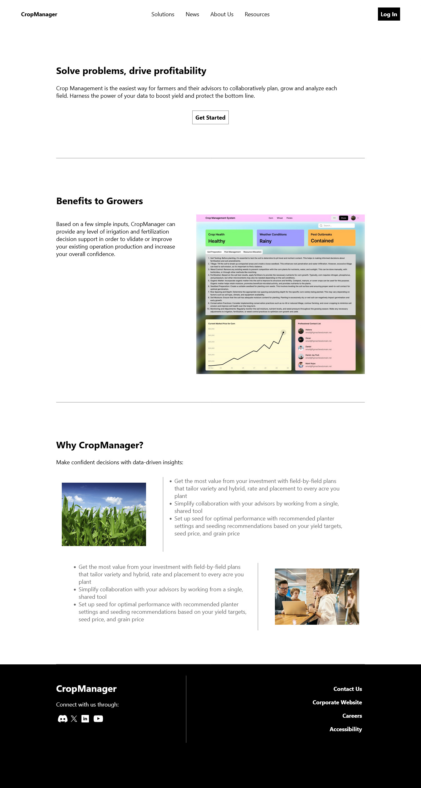
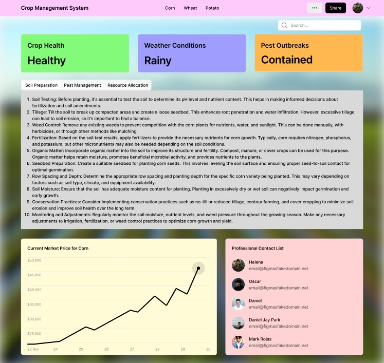

# CropManager

## Product



CropManager is a comprehensive system designed to efficiently manage crops
while integrating technology interventions, providing education and guidance,
and promoting sustainable and efficient crop production. This system aims to
streamline the crop management process, empower farmers, and improve crop
yields.

### Features



1. Crop Management: CropManager allows users to easily track and manage their
   crops, including planting schedules, irrigation needs, pest control, and
   harvest planning.
2. Technology Integration: CropManager integrates technology interventions such
   as crop monitoring sensors, weather forecasts, and data analytics to
   optimize crop production and increase yields.
3. Education and Guidance: CropManager provides educational resources and
   guidance to farmers on best practices for crop management, soil health, pest
   control, and sustainable farming methods.
4. Sustainability: CropManager promotes sustainable farming practices by
   encouraging crop rotation, soil conservation, and water-saving techniques to
   minimize environmental impact and protect natural resources.
5. Efficiency: By streamlining the crop management process and providing
   real-time data and insights, CropManager helps farmers make informed
   decisions and improve efficiency in their operations.

### How to Use

To use CropManager, users can access the system through a the web application.
They can input information about their crops, monitor their progress, and
receive recommendations and alerts based on real-time data and analysis.

### Benefits

1. Improved crop yields and quality
2. Reduced risks of crop disease and pest damage
3. Increased efficiency and productivity
4. Environmental sustainability
5. Empowerment through education and guidance

### Conclusion
By implementing CropManager, farmers can effectively manage their crops,
leverage technology for better outcomes, and contribute to sustainable and
efficient crop production. If you are interested in learning more or
contributing to this project, feel free to reach out to us. Thank you for your
interest in CropManager!


## Development
To get started with the development, clone this repository:

```bash
git clone https://github.com/drnkgn/VHACK2024
```

Then, `cd` into the cloned repository and run:

```bash
npm install     # will take a moment to install necessary packages
npm run dev
```

Make sure `npm` is installed on your machine. Otherwise, install `npm` via
NodeJS. Install NodeJS from [here](https://nodejs.org/en/download).
